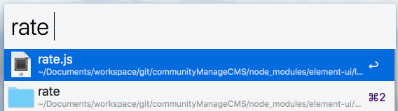

# ExchangeFlow v2
Exchange rate workflow

# How To


KEYWORD CHANGED!!!

USE

```
ex usdcny 100
```

OR

```
usd 100
```

# ChangeLog

v2.0.0
- 支持 macOS 12.3 以上版本（12.3移除了python2，修改以支持python3）

v1.1.1
- 增加汇率转换支持：韩国，巴西，土耳其
# Em...
英文不好，使用的sina的汇率接口查询的即时汇率